# Plataforma Web de Gestão de Projetos TCRA

Este projeto consiste em uma plataforma web desenvolvida para **auxiliar na gestão e no acompanhamento de projetos vinculados ao TCRA (Termo de Compromisso de Recuperação Ambiental)**.

O objetivo da plataforma é **centralizar informações, facilitar análises, acompanhar prazos e reduzir o tempo necessário para elaboração de relatórios ambientais**. A solução contribui para evitar erros, inconsistências, perda de dados e riscos relacionados a entregas em atraso.

A plataforma permite gerenciar o ciclo completo de um projeto TCRA por meio das rotinas de **Projeto, Inventário, Plantio, Monitoramento, Relatórios e Atividades**.

O sistema web compartilha a mesma base de dados do aplicativo mobile Nexus Verde. O aplicativo funciona como uma extensão para coleta de dados em campo, inclusive de maneira offline, enquanto a plataforma web oferece recursos de gestão, análise, acompanhamento e geração de documentos.

---

# Funcionalidades

- Autenticação e controle de acesso
- Gerenciamento de projetos TCRA
- Centralização do histórico dos projetos
- Cadastro e importação de inventários arbóreos
- Integração com dados coletados pelo aplicativo mobile
- Registro de plantio e informações técnicas
- Planejamento e execução de monitoramentos
- Classificação dos indicadores de monitoramento
- Acompanhamento de prazos, entregas e pendências
- Cálculo do Índice de Conformidade Técnica (ICT)
- Geração de relatórios de inventário
- Geração de documentos auxiliares de monitoramento em PDF
- Geração da planilha de acompanhamento CETESB
- Planejamento, execução e validação de atividades
- Visualização de mapas, gráficos, alertas e resumos executivos

---

# Telas da Plataforma

## Tela de Login

Tela utilizada para autenticação e acesso à plataforma.

  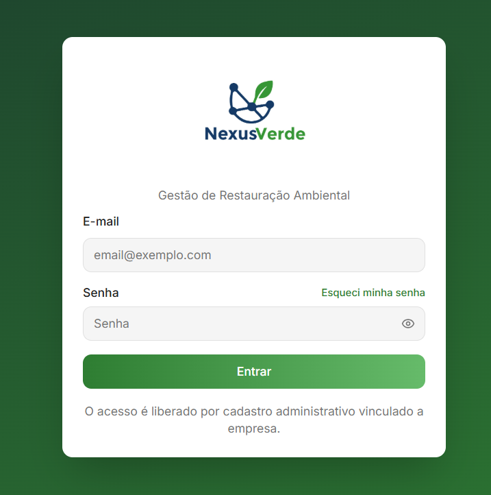

---

## Tela de Projetos

Tela responsável pela listagem, pesquisa e gerenciamento dos projetos TCRA.

  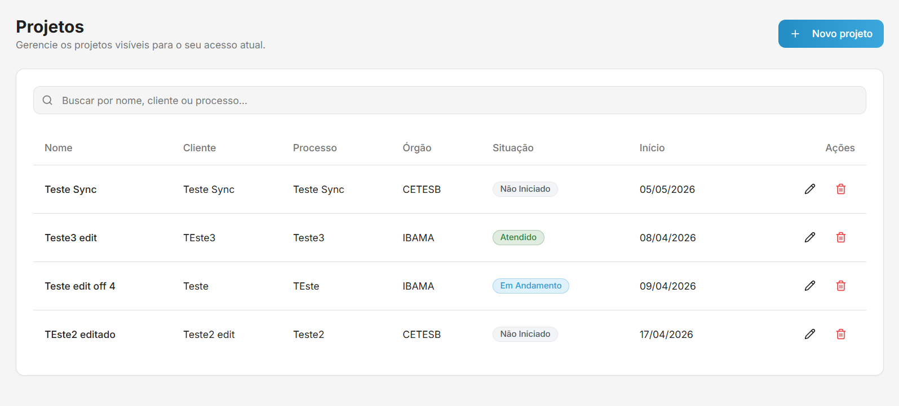

---

## Tela de Detalhes do Projeto

Apresenta informações gerais, histórico, alertas, indicadores e resumo executivo do projeto.

  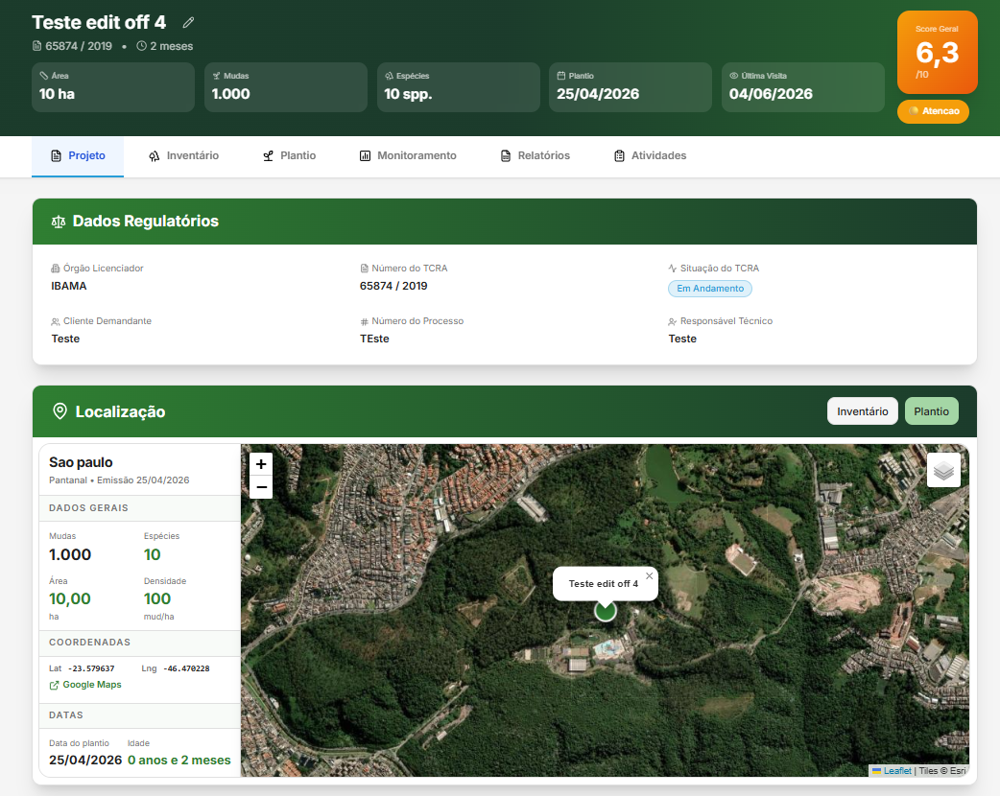
  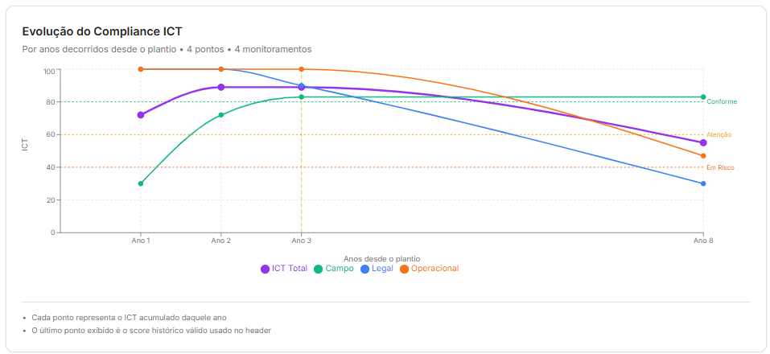
  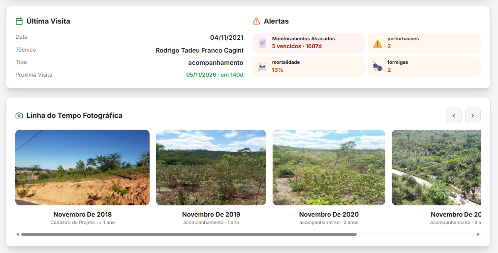

---

## Rotina de Inventário

Permite cadastrar ou importar áreas e árvores, registrar informações técnicas, coordenadas geográficas, fotografias e dados relacionados à supressão.

  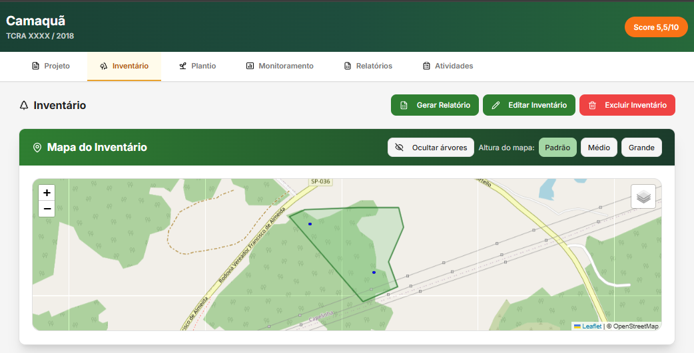
  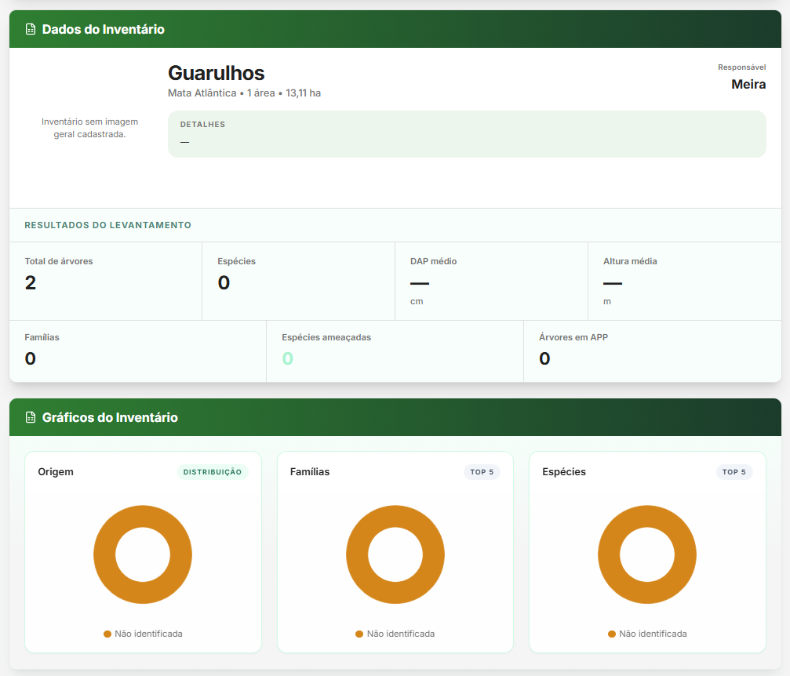

---

## Rotina de Plantio

Utilizada para registrar a área de plantio, quantidade de mudas, espécies, datas, densidade e responsáveis.

  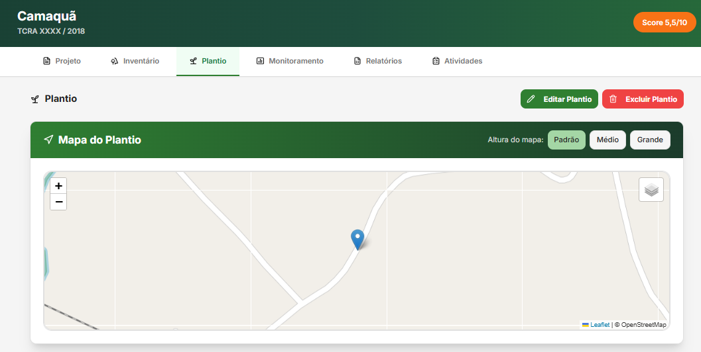
  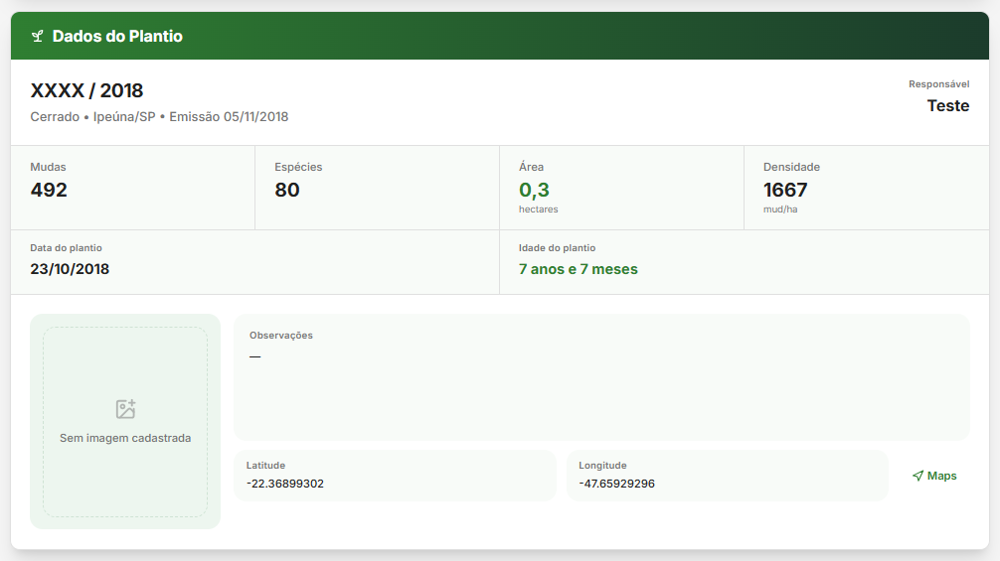

---

## Rotina de Monitoramento

Permite planejar monitoramentos, registrar parcelas e evidências, classificar indicadores e acompanhar a evolução do projeto.

  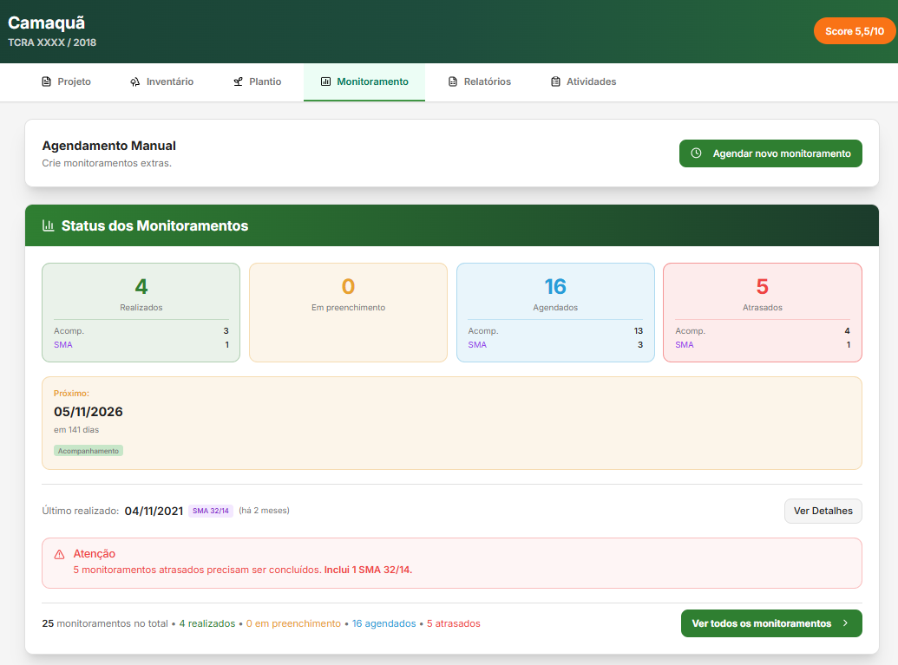
  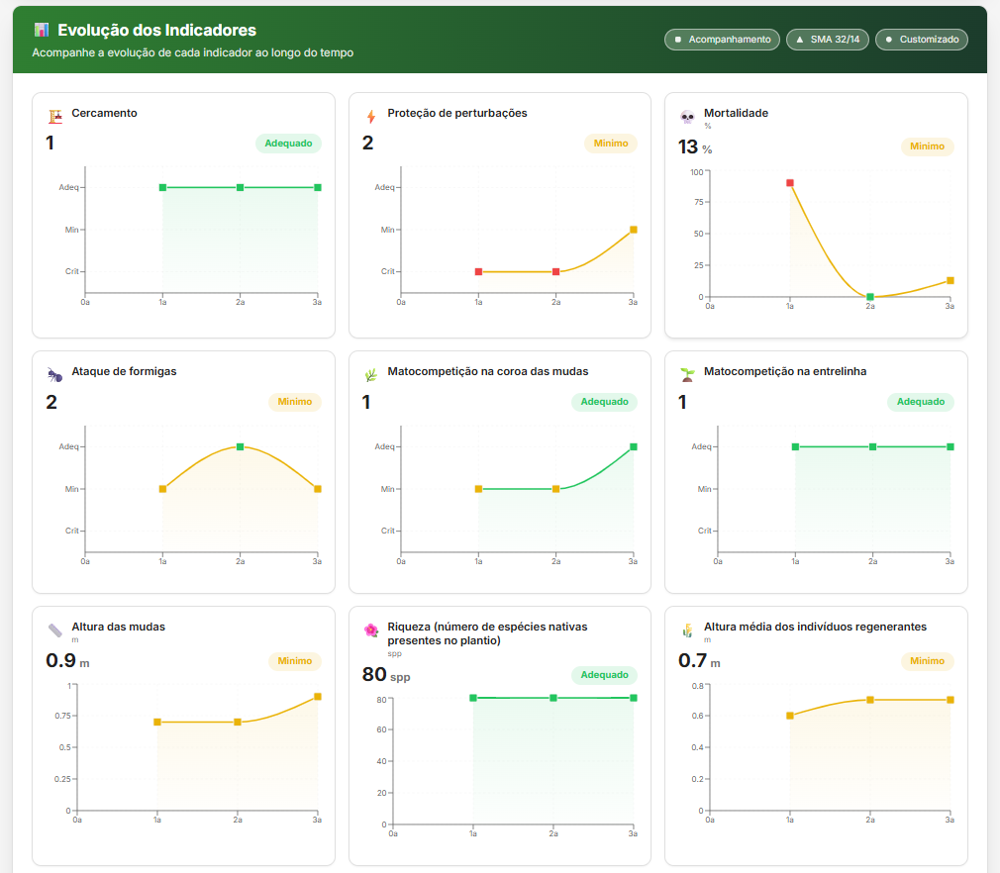

---

## Rotina de Relatórios

Tela destinada ao acompanhamento de entregas e à geração de relatórios de inventário, documentos de monitoramento e planilhas CETESB.

  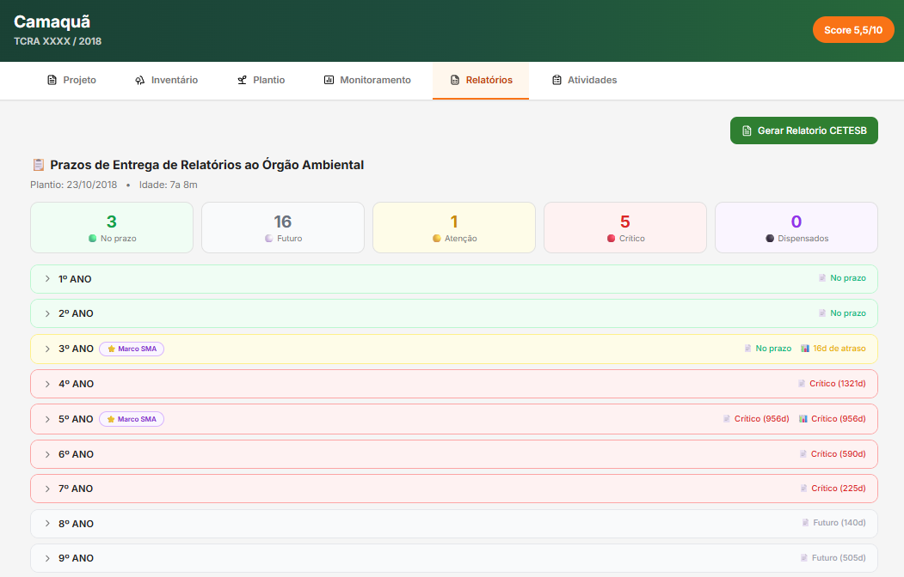

---

## Rotina de Atividades

Permite planejar tarefas, definir responsáveis, registrar execuções, anexar evidências e validar atividades.

  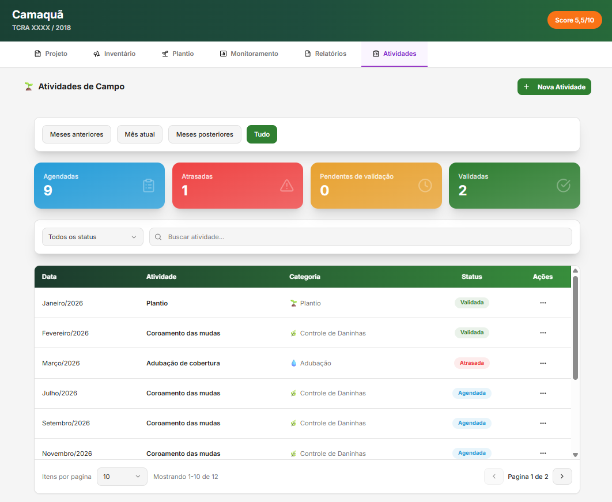
  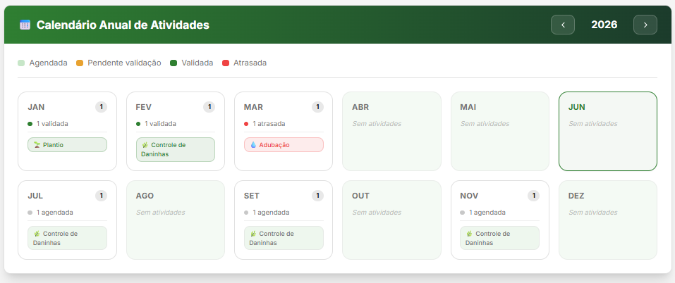

---

# Tecnologias Utilizadas

- React
- TypeScript
- Vite
- Tailwind CSS
- Firebase
- Firestore
- Firebase Authentication
- Firebase Storage
- Firebase Functions
- Leaflet
- Recharts
- jsPDF e html2canvas
- SheetJS / XLSX
- Vitest e Testing Library
- Git e GitHub
